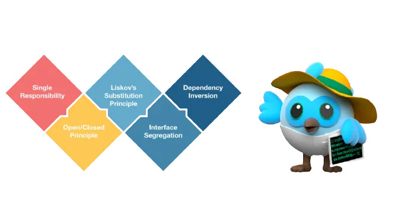

# Content should include

* Beautiful and the art of coding
* Design Patterns
* Software Design Principles

---

# Writing Clean Code in Flutter

## Introduction

In Flutter development, writing clean and maintainable code is essential for the long-term success of a project. Clean code not only makes the codebase easier to understand but also facilitates collaboration among team members and reduces the likelihood of bugs. This document outlines best practices and guidelines for writing clean code in Flutter.

### 1. Beautiful and the art of coding

#### 1.1 File Structure

- Organize files logically within the project directory.
- Use folders to group related files (e.g., models, screens/views, controller, services ..etc).

  * **Model**

    - Models are just classes which help us to determine the structure of the data (skeleton/គ្រោងឆ្អឹង)
    ```dart
    class Product{
      String name;
      double price;
      String quantity;
    
      Product({required this.name,required this.price,required this.quantity});
    }
    ```

  * **Screens/Views**

    - Views contains the various pages or screens of your application. The Views can also contain sub-folders that contains related views together.

  * **Controller**

    - The controller manages the screens' state and business logic. It notifies the Builder when the state changes.

    ```dart
    // ORIGINAL:
    class ProfileScreen extends StatefulWidget {
      @override
      _ProfileScreenState createState() => _ProfileScreenState();
    }
    
    class _ProfileScreenState extends State<ProfileScreen> {
      String inputText = '';
    
      @override
      Widget build(BuildContext context) {
        return TextField(
          onChanged: (value) {
            setState(() {
              inputText = value; // Update the inputText whenever the user types (This is where the state change)
            });
          },
          decoration: InputDecoration(
            hintText: 'Type something...',
          ),
        );
      }
    }
    
    // IMPROVED:
    class UserController extends GetxController {
      final inputText = Rx<String>('');
    
      // Update input text
      void updateInputText(String value) {
        inputText.value = value;
      }
    }
    
    class ProfileScreen extends StatelessWidget {
      ProfileScreen({Key key}) : super(key: key);
    
      @override
      Widget build(BuildContext context) {
        final controller = Get.put(UserController());
        return TextField(
          onChanged: controller.updateInputText,
          decoration: InputDecoration(
            hintText: 'Type something...',
          ),
        );
      }
    }
    
    ```

  * **Service**

    - Services contains files that makes Apis calls or interact with external network such as HTTP or background location services.Files in this folder are strictly concerned with making requests
    ```dart
    class UserService{
    
      User getProfile() async {
        // Makes http calls here with Dio or GraphQL etc..
      }
    
    }
    ```

* **Structure**

```dart
// BAD:
project_directory/
│
├── lib/
│   ├── login_screen.dart
│   ├── product_screen.dart
│   ├── profile_screen.dart
│   ├── authentication_model.dart
│   ├── product_model.dart
│   ├── user_model.dart
│   ├── authentication_controller.dart
│   ├── product_controller.dart
│   ├── profile_controller.dart
│   ├── authentication_service.dart
│   ├── product_service.dart
│   └── profile_service.dart
│
└── main.dart

// GOOD:
project_directory/
│
├── lib/
│   ├── screens/
│   │   ├── login_screen.dart
│   │   ├── product_screen.dart
│   │   └── profile_Screen.dart
│   │
│   ├── models/
│   │   ├── authentication_model.dart
│   │   ├── product_model.dart
│   │   └── user_model.dart
│   │
│   ├── controllers/
│   │   ├── product_controller.dart
│   │   ├── profile_controller.dart
│   │   └── authentication_controller.dart
│   │
│   └── services/
│       ├── authentication_service.dart
│       ├── product_service.dart
│       └── profile_service.dart
│
└── main.dart
```

#### 1.2 Meaningful Names

##### 1.2.1 Variable Names

- Use descriptive names that convey the purpose of the variable.
- Avoid abbreviations and single-letter variable names.

```dart
// DON'T: Using non-descriptive variable names
var a = 10;

// DO: Using descriptive variable names
var numberOfItems = 10;
```

##### 1.2.2 Class Names

Class names should be nouns and written in UpperCamelCase.
Use descriptive names that reflect the class's responsibility.

```dart
// DON'T: Non-descriptive class name
class XYZ {}

// DO: Descriptive class name
class UserRepository {}
```

##### 1.2.3 Searchable Names

Use searchable names instead of calling it inside the function

```dart
// DON'T:

Future.delayed(const Duration(minutes: 30), () { 
  debugPrint('some logic here');
}); 

// DO:
const MINUTES_DURATION = 30;

Future.delayed(const Duration(minutes: MINUTES_DURATION), () { 
  debugPrint('some logic');
}); 
```

#### 1.2.4 Make sure folders and files are properly named.

```dart
// DON'T: these are all wrong
loginView.dart
LoginView.dart
loginview.dart
Login_View.dart

// DO: this is the proper way to name a file
login_view.dart
```

#### 1.3 API call

Use Future.wait to make concurrent API calls
By using Future.wait, you can initiate multiple async tasks at the same time. Thereby reducing the overall execution time

```dart
// DON'T:
Future callMultipleApis() async { 
  await getUserInfo(); 
  await getLocations();
} 

// DO:
Future callMultipleApis() async { 
  await Future.wait([
    getUserInfo(), 
    getLocations(), 
  ]);
}
```

#### 1.4 Don't make duplicate code

Avoid duplicate code as much as possible. Duplications can complicate maintenance and updates, leading to inconsistencies. Instead, create a solid abstraction that can handle multiple scenarios with a single function or module. However, ensure that the abstraction is well-designed and follows the SOLID principles.

```dart
// DON'T: Avoid repeating the same code.
void main() {
  print("Hello, Alice!");
  print("Hello, Bob!");
}

// DO: Create a function to handle repetitive tasks.
String greet(String name) {
  return "Hello, $name!";
}

void main() {
  print(greet("Alice"));
  print(greet("Bob"));
}
```

#### 1.5 Creating Custom Widgets

By creating custom widgets, you avoid duplicating code across your application. Once you've defined a custom widget, you can reuse it multiple times in different parts of your app. On top of that, you ensure that similar components look and behave the same way across your app.

```dart
// ORIGINAL: A single widget instance. If you need to modify anything within the button, you'll have to update each instance individually.
ElevatedButton(
      onPressed: (){},
      child: Text('Press Me'),
    );

// IMPROVED: Customizable button widget allowing easy modification of text and behavior in a single file.
class MyCustomButton extends StatelessWidget {
  final String text;
  final VoidCallback onPressed;

  CustomButton({required this.text, required this.onPressed});

  @override
  Widget build(BuildContext context) {
    return ElevatedButton(
      onPressed: onPressed,
      child: Text(text),
    );
  }
```

#### 1.6 Should not avoid Linter rules

- Linting allows you to identify styling and error rules in your code and make them immediately apparent in your IDE. By ignoring linter rules, you risk sacrificing so many benefits, potentially leading to inconsistencies, lower quality code, and increased difficulty in maintaining and collaborating on the project. Therefore, it's generally advisable to adhere to linter rules to ensure code quality and consistency.
- At the same time, using **ignore_for_file** in Flutter/Dart to suppress warnings is not advisable because:
  * It reduces code clarity.
  * Important warnings might be overlooked.
  * It adds maintenance overhead.
  * It can lead to lower code quality over time.

```dart
// DON'T : We should remove the command ignore_for_file || Ignoring for better code maintainability and quality

// ignore_for_file: unused_import, avoid_print

import 'dart:math'; // Ignoring unused_import warning

void main() {
  print("This is a message."); // Ignoring avoid_print warning
  var result = calculateSquare(5);
  print("Square of 5 is $result");
}

int calculateSquare(int num) {
  return num * num;
}
```

---

### 2. Design Patterns (S.O.L.I.D Principle)



#### 2.1 S — Single Responsibility Principle (SRP)

The idea behind the SRP is that every class, module, or function in a program should have one responsibility/purpose in a program. As a commonly used definition, "every class should have only one reason to change".

Consider the example below:

```dart
// DO:
class Student {
  void registerStudent() {
    // some logic
  }

  void calculateStudentResults() {
    // some logic
  }

  void sendEmail() {
    // some logic
  }
}
```

The class above violates the single responsibility principle. Why?
This Student class has three responsibilities – registering students, calculating their results, and sending out emails to students.

The code above will work perfectly but will lead to some challenges. We cannot make this code reusable for other classes or objects. The class has a whole lot of logic interconnected that we would have a hard time fixing errors.

Imagine a new developer joining a team with this sort of logic with a codebase of about two thousand lines of code all congested into one class.

Now let's fix this

```dart
// DO:
class StudentRegister {
  void registerStudent() {
    // some logic
  }
}

class StudentResult{
  void calculateStudentResults() {
    // some logic
  }
}

class StudentEmails{
  void sendEmail() {
    // some logic
  }
}
```

Also imagine a widget handling UI rendering, data retrieval, and business logic. Sounds messy, right? SRP advocates for splitting responsibilities. For instance, rather than a monolithic widget, use dedicated widgets for UI, providers, blocs or GetX for state management, and repositories for data operations.

```dart
// DON'T:
class UserProfile extends StatelessWidget {
  final User user;
  //... constructor and other methods

  Future<UserData> fetchUserData() async {
    // Fetch logic here (asynchronous)
    // ...
  }

  @override
  Widget build(BuildContext context) {
    // Fetching user data (Not a UI responsibility!)
    user = fetchUserData(user.id);

    return Text(data.name);
  }
}
```

Instead, separate responsibilities:

```dart
class UserController extend GetxController {

Final user= Rxn<User>(null);

@override
  void onInit() {
    fetchUserData();
  }


  // Handles data fetching logic
  Future<UserData> fetchUserData(int id) async {
    // Fetch logic here (asynchronous) from service
    // ...
	user.value = result;
  }
}

class UserProfile extends StatelessWidget {

  UserProfile({Key key}) : super(key: key);

  @override
  Widget build(BuildContext context) {
    final controller = Get.put(UserController());
    return Text(controller.user.value.name)
    );
  }
}
```

#### 2.2 O — Open/Closed Principle (OCP)

The open-closed principle states that software entities should be open for extension, but closed for modification.
This implies that such entities – classes, functions, and so on – should be created in a way that their core functionalities can be extended to other entities without altering the initial entity's source code.

What if you now need to draw squares? Instead of altering the widget, design it in a way that allows adding new shapes without changing the existing code. Maybe introduce a base Shape class and extend it for various forms.

Instead of:
```dart
// DON'T
class ShapePainter {
  final String shapeType;

  draw() {
    if (shapeType == 'circle') {
      // Draw circle
    } else if (shapeType == 'square') {
      // Draw square
    }
  }
}
```

Opt for:

```dart
// DO
abstract class Shape {
  void draw();
}

class Circle implements Shape {
  void draw() {
    // Draw circle
  }
}

class Square implements Shape {
  void draw() {
    // Draw square
  }
}

class ShapePainter {
  final Shape shape;
  void draw() => shape.draw();
}
```

#### 2.3 L — Liskov Substitution Principle (LSP)

According to Barbara Liskov and Jeannette Wing, the Liskov substitution principle states that:

Don't worry if you find that confusing, it will all make sense soon. Let's simplify this principle below:

The Liskov substitution principle simply implies that when an instance of a class is passed/extended to another class, the inheriting class should have a use case for all the properties and behavior of the inherited class.

Imagine having a base Bird class and a derived Penguin class. If the Bird class has a fly method, it wouldn't fit the Penguin. LSP suggests that derived classes should perfectly fit the behaviors of their base classes. Here, we might need a rethinking of our class design.

Instead of:

```dart
// DON'T
class Bird {
  void fly() {}
}

class Penguin extends Bird {} // Penguin can't fly!
```

Refactor to:

```dart
// DO
class Bird {
  void move() {
    // Common implementation for all birds
  }
}

class Sparrow extends Bird {
  void move() {
    // Some Logic here
  }
  // The move method from Bird is reused, no new methods are added
}

class Penguin extends Bird {
  void move() {
    // Some Logic here
  }
  // The move method from Bird is reused, no new methods are added
}
```

#### 2.4 I — Interface Segregation Principle (ISP)

The interface segregation principle states that the interface of a program should be split in a way that the user/client would only have access to the necessary methods related to their needs.

To understand this better, we'll first look at an example that violates the ISP:

```dart
// DON'T
abstract class Teacher {
  void english();

  void biology();

  void chemistry();
  
  void mathematics();
}

class Jane implements Teacher {
  @override
  void english() {
    print("Jane is teaching the students English language.");
  }

  @override
  void biology() {
    // Implement the biology method if needed
  }

  @override
  void chemistry() {
    // Implement the chemistry method if needed
  }

  @override
  void mathematics() {
    // Implement the mathematics method if needed
  }
}
```

From the code above, you can tell that Jane is an English teacher who has no business with the other subjects. But these other methods are extended by default with the Teacher interface.

Do not confuse the Liskov substitution principle and the interface segregation principle.The Liskov Substitution Principle emphasizes that a subclass should inherit from a base class only if it genuinely needs the base class's methods.

In contrast, the Interface Segregation Principle advises against creating interfaces with excessive methods, as some may be irrelevant for specific users when extended.

Now let's fix the code in the last example and break it down.

```dart
// DO
abstract class EnglishTeacher {
  void english();
}

abstract class BiologyTeacher {
  void biology();
}

abstract class ChemistryTeacher {
  void chemistry();
}

// ...

class Jane implements EnglishTeacher {
  @override
  void english() {
    print("Jane is teaching the students English language.");
  }
}
```

Now the Teacher class now has only one method. You can extend from the teacher class without getting other unecessary **methods**.

#### 2.5 D — Dependency Inversion Principle (DIP)

The dependency inversion principle states:

	High-level modules should not import anything from low-level modules. Both should depend on abstractions

And,

	Abstractions should not depend on details. Details (concrete implementations) should depend on abstractions.

Suppose your widget directly initializes and interacts with a database. That’s a rigid design. If you switch databases, you’ll need significant changes. Instead, depend on abstract classes or interfaces. Use dependency injection to provide the concrete implementations, making your system more modular and testable.

 *Example*

 Rather than:

 ```dart
class LightSwitch {
  final Bulb bulb;

  void operate() {
    bulb.toggle();
  }
}
```

Go for:

```dart
abstract class Switchable {
  void toggle();
}

class Bulb implements Switchable {
  void toggle() {
    // Toggle bulb
  }
}

class LightSwitch {
  final Switchable device;

  void operate() {
    device.toggle();
  }
}
```

### Why SOLID in Flutter?

#### Robust Architecture:
Structuring your Flutter codebase around SOLID principles, which include Single Responsibility Principle (SRP), Open/Closed Principle (OCP), Liskov Substitution Principle (LSP), Interface Segregation Principle (ISP), and Dependency Inversion Principle (DIP), leads to a more robust architecture.

- **Single Responsibility Principle (SRP):**
  - Each class or module has a single responsibility, making it easier to understand and maintain.
  
- **Open/Closed Principle (OCP):**
  - Code is designed to be open for extension but closed for modification, promoting scalability and reducing the risk of introducing bugs.

- **Liskov Substitution Principle (LSP):**
  - Subtypes can be substituted for their base types without affecting the correctness of the program, ensuring proper inheritance.

- **Interface Segregation Principle (ISP):**
  - Interfaces are kept concise and relevant, preventing unnecessary dependencies and improving code clarity.

- **Dependency Inversion Principle (DIP):**
  - High-level modules are not dependent on low-level modules; both depend on abstractions. This inversion of control enhances flexibility and maintainability.

#### Flexibility:
Adhering to SOLID principles brings increased flexibility to your Flutter project.

- **Easier Changes:**
  - Modifications to the codebase become less daunting due to the modular and well-organized structure.
  
- **Smoother Feature Additions:**
  - Adding new features is a smoother process, as the codebase is designed to accommodate changes without disrupting existing functionality.

#### Testability:
SOLID principles significantly enhance the testability of your Flutter application.

- **Decoupled Components:**
  - Components are decoupled, making unit testing straightforward and enabling the isolation of specific functionalities for testing.
  
- **Improved Maintainability:**
  - Unit tests become more manageable, leading to better code maintenance and reducing the likelihood of introducing regressions.

In summary, adopting SOLID principles in Flutter not only results in a more maintainable and scalable codebase but also provides flexibility for future changes and greatly facilitates the testing process.

### Conclusion
While the SOLID principles might sound theoretical initially, applying them can lead to tangible benefits in your Flutter projects. As you craft more apps, these principles can be your trusty companions, guiding you towards cleaner, more efficient, and joyous coding adventures!

---

### 3. Software Design Principles

---

## Conclusion

Adhering to clean code principles in Flutter development leads to a more maintainable and scalable codebase. By following the guidelines outlined in this document, developers can write code that is easier to understand, test, and extend, ultimately improving the quality of Flutter applications.

---

## References

-[https://medium.com/@flutterdynasty/design-patterns-in-flutter-25191278149c
](url)

-[https://blog.stackademic.com/solid-principles-in-flutter-crafting-robust-apps-0e1d1bcefeca](url)

-[https://www.freecodecamp.org/news/solid-principles-single-responsibility-principle-explained/](url)
